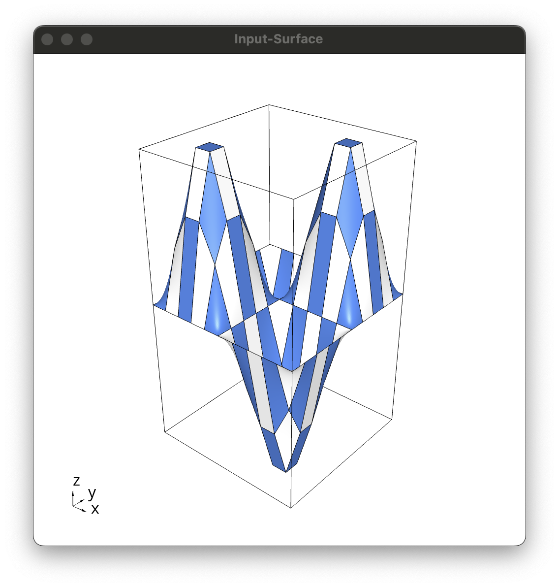
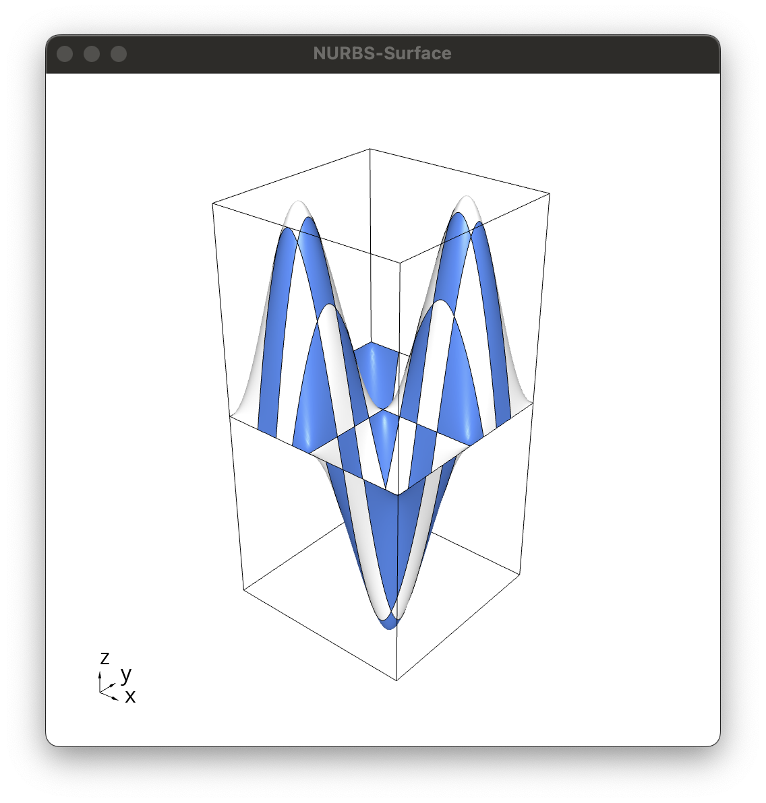
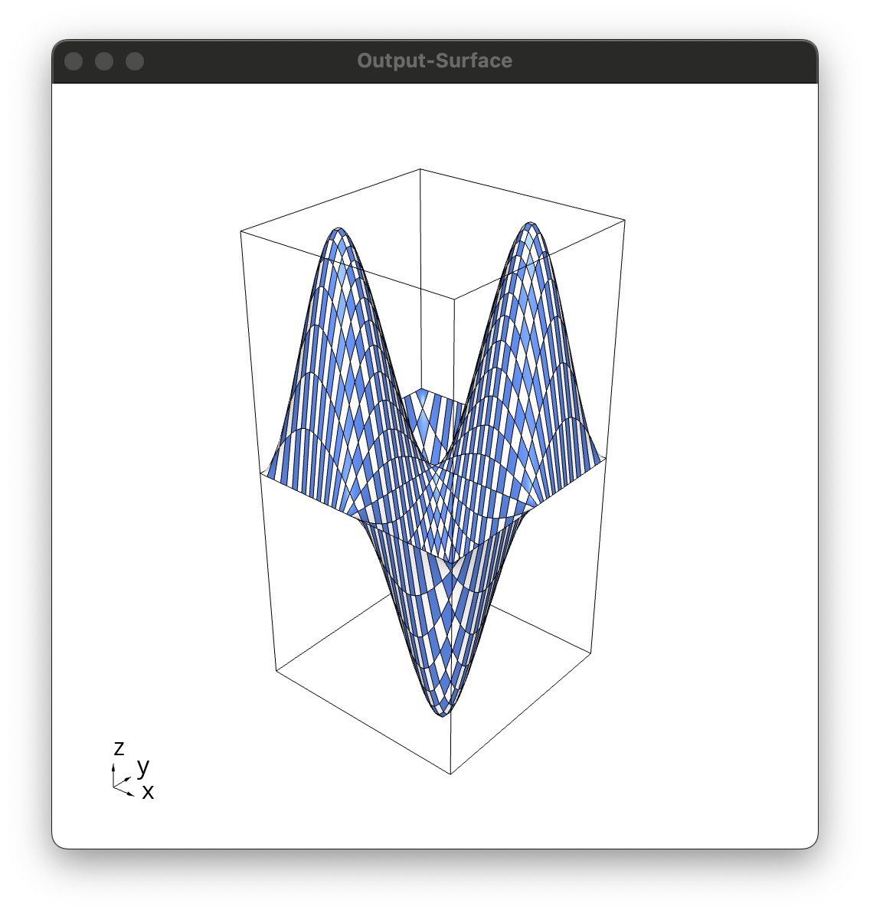

# NURBS Surface Interpolation Minapp Examples

Saved data from MFEM Pull Request [#4841](https://github.com/mfem/mfem/pull/4841)

## Example 1 (Sine wave) Upsampling

| Input Surface | NURBS Surface | Output Surface |
:--------------:|:-------------:|:---------------:
 |  | 

