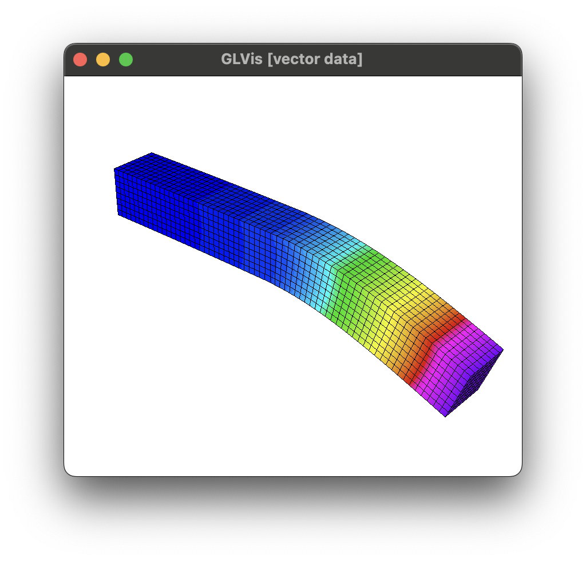
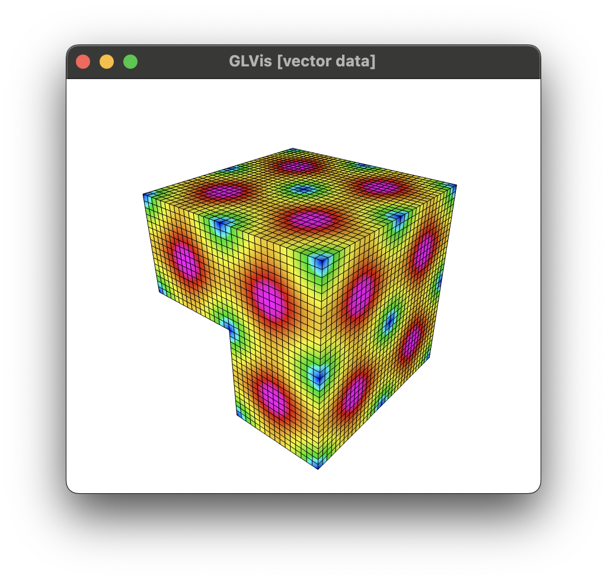
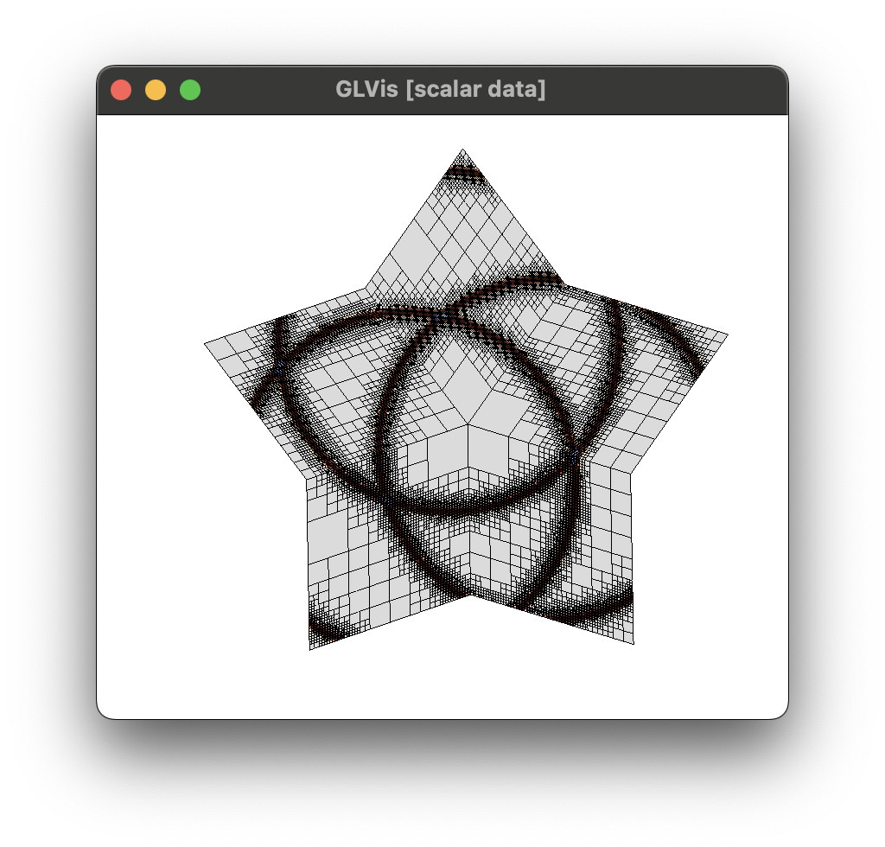

# PISALE Summer School 2025

## MFEM Examples Sample Runs

<table align="center">
<thead style="border: none !important;">
<tr>
    <td align="center"><a href="https://glvis.org/live/?stream=https://raw.githubusercontent.com/tzanio/data/main/pisale/ex1.saved"></a> </td>
    <td align="center"><a href="https://glvis.org/live/?stream=https://raw.githubusercontent.com/tzanio/data/main/pisale/ex1-3d.saved"></a></td>
    <td align="center"><a href="https://glvis.org/live/?stream=https://raw.githubusercontent.com/tzanio/data/main/pisale/ex1-surf.saved"></a></td>
    <td align="center"><a href="https://glvis.org/live/?stream=https://raw.githubusercontent.com/tzanio/data/main/pisale/ex1p.saved"></a></td>
    <td align="center"><a href="https://glvis.org/live/?stream=https://raw.githubusercontent.com/tzanio/data/main/pisale/ex2.saved"></a></td>
    <td align="center"><a href="https://glvis.org/live/?stream=https://raw.githubusercontent.com/tzanio/data/main/pisale/ex3.saved"></a></td>
    <td align="center"><a href="https://glvis.org/live/?stream=https://raw.githubusercontent.com/tzanio/data/main/pisale/ex9.saved"></a></td>
    <td align="center"><a href="https://glvis.org/live/?stream=https://raw.githubusercontent.com/tzanio/data/main/pisale/ex15.saved"></a></td>
    <td align="center"><a href="https://glvis.org/live/?stream=https://raw.githubusercontent.com/tzanio/data/main/pisale/ex37p.saved"></a></td>
</tr>
</table>
    
### Example 1 (Diffusion)


```
./ex1
```

<a href="https://glvis.org/live/?stream=https://raw.githubusercontent.com/tzanio/data/main/pisale/ex1.saved"></a>

```
./ex1 -m ../data/escher-p3.mesh
```

<a href="https://glvis.org/live/?stream=https://raw.githubusercontent.com/tzanio/data/main/pisale/ex1-3d.saved"></a>

```
./ex1 -m ../data/mobius-strip.mesh
```

<a href="https://glvis.org/live/?stream=https://raw.githubusercontent.com/tzanio/data/main/pisale/ex1-surf.saved"></a>

```
mpirun --map-by :OVERSUBSCRIBE -np 32 ./ex1p
```

<a href="https://glvis.org/live/?stream=https://raw.githubusercontent.com/tzanio/data/main/pisale/ex1p.saved"></a>

### Example 2 (Elasticity)


```
./ex2 -m ../data/beam-hex.mesh
```

<a href="https://glvis.org/live/?stream=https://raw.githubusercontent.com/tzanio/data/main/pisale/ex2.saved"></a>

### Example 3 (Electromagnetic Diffusion)


```
./ex3 -m ../data/fichera.mesh
```

<a href="https://glvis.org/live/?stream=https://raw.githubusercontent.com/tzanio/data/main/pisale/ex3.saved"></a>

### Example 9 (Advection)

```
./ex9 -m ../data/periodic-square.mesh -p 3 -r 4 -dt 0.0025 -tf 9 -vs 20
```

<a href="https://glvis.org/live/?stream=https://raw.githubusercontent.com/tzanio/data/main/pisale/ex9.saved"></a>

### Example 15 (Adaptive Mesh Refinement)

```
./ex15 -n 3
```

<a href="https://glvis.org/live/?stream=https://raw.githubusercontent.com/tzanio/data/main/pisale/ex15.saved"></a>

### Example 37 (Topology Optimization)

```
mpirun --map-by :OVERSUBSCRIBE -np 4 ex37p -lambda 0.1 -mu 0.1
```

<a href="https://glvis.org/live/?stream=https://raw.githubusercontent.com/tzanio/data/main/pisale/ex37p.saved"></a>
