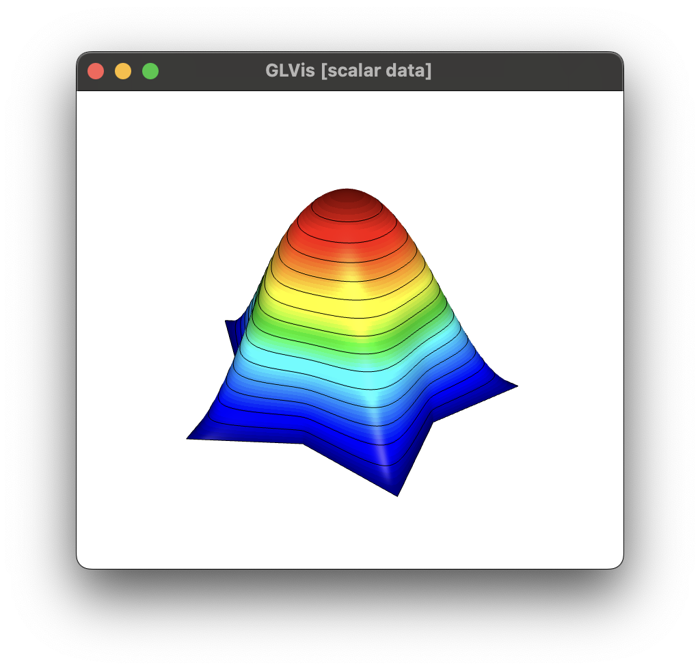
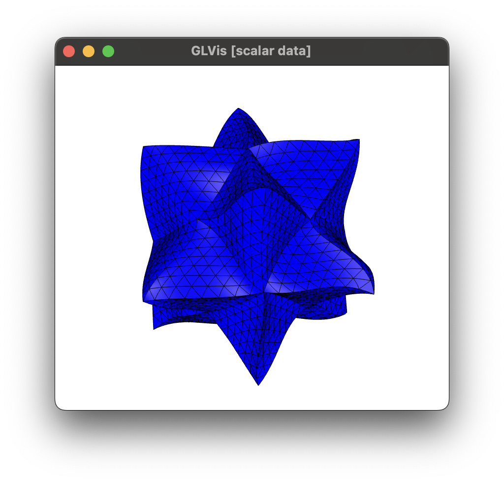
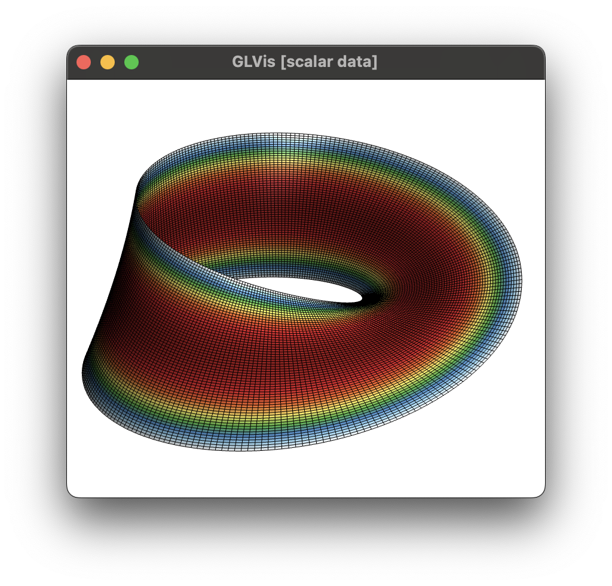
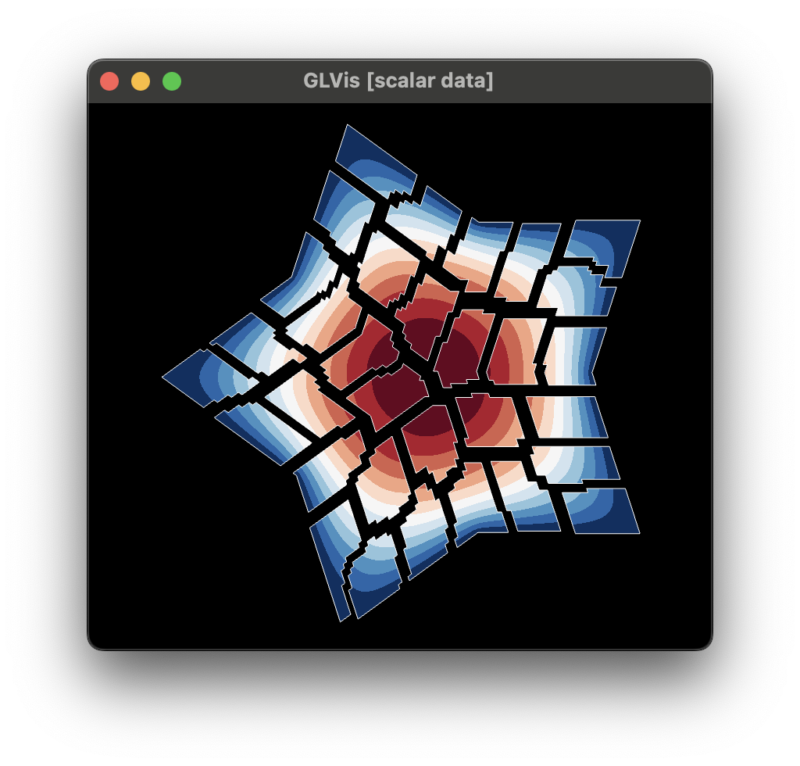
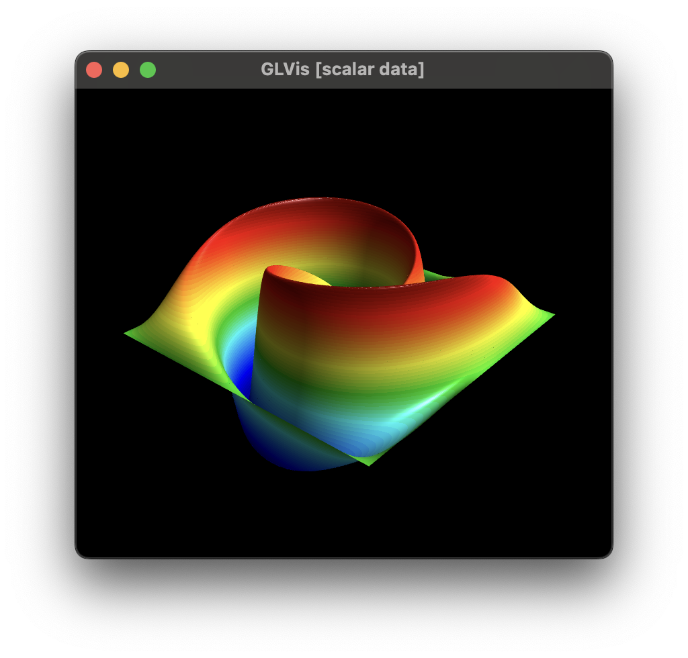
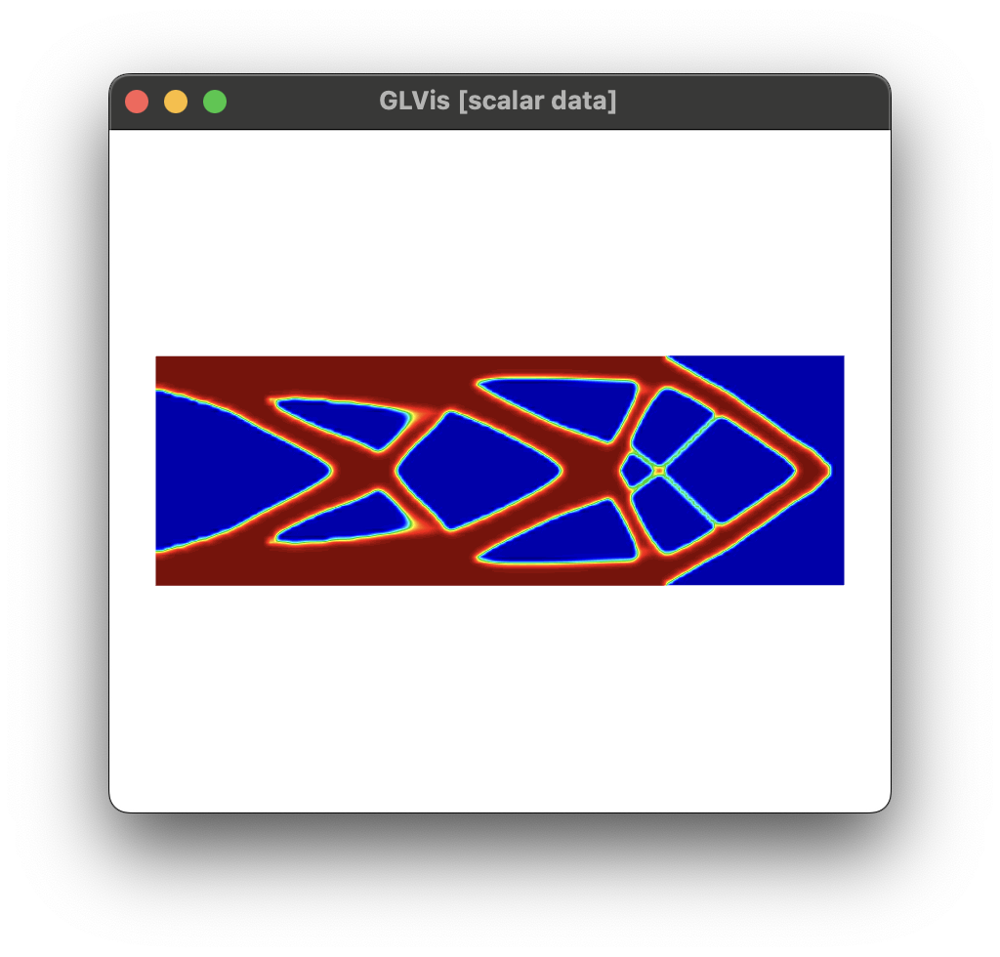

# PISALE Summer School 2025

Saved data from several MFEM examples runs.

## Example 1 (Diffusion)

```
./ex1
```

<a href="https://glvis.org/live/?stream=https://raw.githubusercontent.com/tzanio/data/main/pisale/ex1.saved"></a>

```
./ex1 -m ../data/escher-p3.mesh
```

<a href="https://glvis.org/live/?stream=https://raw.githubusercontent.com/tzanio/data/main/pisale/ex1-3d.saved"></a>

```
./ex1 -m ../data/mobius-strip.mesh
```

<a href="https://glvis.org/live/?stream=https://raw.githubusercontent.com/tzanio/data/main/pisale/ex1-surf.saved"></a>

```
mpirun --map-by :OVERSUBSCRIBE -np 32 ./ex1p
```

<a href="https://glvis.org/live/?stream=https://raw.githubusercontent.com/tzanio/data/main/pisale/ex1p.saved"></a>

## Example 9 (Advection)

```
ex9 -m ../data/periodic-square.mesh -p 3 -r 4 -dt 0.0025 -tf 9 -vs 20
```

<a href="https://glvis.org/live/?stream=https://raw.githubusercontent.com/tzanio/data/main/pisale/ex9.saved"></a>

## Example 37 (Topology Optimization)

```
mpirun --map-by :OVERSUBSCRIBE -np 4 ex37p -lambda 0.1 -mu 0.1
```

<a href="https://glvis.org/live/?stream=https://raw.githubusercontent.com/tzanio/data/main/pisale/ex37p.saved"></a>
